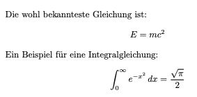
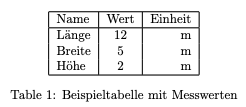
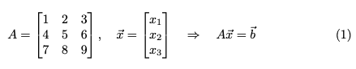
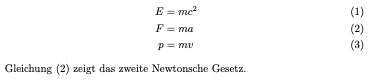
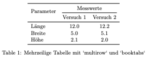
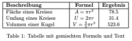
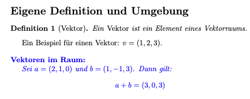

# LaTeX Workshop

Willkommen zum LaTeX-Workshop!  
In diesem Repository findest du **Anleitungen**, **Übungsaufgaben**, **Tipps & Tricks** sowie **Troubleshooting-Hinweise** rund um LaTeX für wissenschaftliches Arbeiten und technische Dokumentation.

---

## 🗓️ Workshop-Plan

| Einheit | Thema | Inhalt |
|----------|--------|--------|
| 1 | Grundlagen & Dokumentstruktur | Kurzer Überblick, minimale Dokumente, Abschnittsstruktur, Textformatierung |
| 2 | Mathe, Tabellen, Grafiken | Formeln, align-Umgebungen, Tabellen mit Formatierung, Abbildungen mit Beschriftung |
| 3 | Literatur & Best Practices | Bibliographien, nützliche Pakete, saubere Struktur, Wiederverwendung |

Gesamtzeit: **08:50–11:15 Uhr (inkl. 15 Min Pause)**

---

## 🚀 Einstieg

### 1️⃣ Setup
- **Empfohlen:** [Overleaf](https://www.overleaf.com)
  - oder eine weitere [Cloud-basierte Alternative](#-übersicht-cloudbasierte-latex-editoren)
- **Alternativ:**  
  - Installation von TeX Live oder MikTeX  
  - Editor: VS Code + *LaTeX Workshop*-Extension
 

### 2️⃣ Minimales Dokument
```latex
\documentclass[a4paper,11pt]{article}
\begin{document}
Hallo Welt! Dies ist mein erstes LaTeX-Dokument.
\end{document}
```

---

## 📘 Einheit 1 — Grundstruktur & Formatierung

### 🔹 Ziele
- Dokumentaufbau verstehen (`\documentclass`, `\begin{document}`)
- Abschnitte, Listen und Textauszeichnungen einsetzen

### 🧩 Aufgabe 1
Erstelle ein Dokument mit:
- Titel, Autor, Datum  
- Zwei Abschnitten: *Einleitung* & *Hauptteil*  
- Eine Liste (`itemize` oder `enumerate`)

### 💡 Tipp
Nutze `\maketitle` für automatische Titelerstellung.

---

## 🧮 Einheit 2 — Mathe, Tabellen & Abbildungen

### 🧩 Aufgabe 2: Formeln
Füge diese Formeln in dein Dokument ein:




### 🧩 Aufgabe 3: Tabelle
Erstelle eine 3x3-Tabelle mit Überschriften:



### 🧩 Aufgabe 4: Abbildung
Binde eine Grafik ein (z. B. `example-image`) mit Beschriftung und Referenz:
```latex
\begin{figure}[h]
  \centering
  \includegraphics[width=0.5\textwidth]{example-image}
  \caption{Beispielbild}
  \label{fig:beispiel}
\end{figure}
```

### 💡 Tipps
- Paket `graphicx` verwenden (`\usepackage{graphicx}`)
- Verweise mit `\ref{fig:beispiel}` einfügen

---

## 📚 Einheit 3 — Literatur, Pakete & Best Practices

### 🧩 Aufgabe 5: Literaturverzeichnis
Erstelle eine Datei `literatur.bib`:
```latex
@book{lamport1994,
  author = {Leslie Lamport},
  title = {LaTeX: A Document Preparation System},
  year = {1994},
  publisher = {Addison-Wesley}
}
```
und verwende:
```latex
\usepackage[backend=biber,style=numeric]{biblatex}
\addbibresource{literatur.bib}
```

Im Text zitieren mit `\cite{lamport1994}`.

Weitere 3 Quellen auf Google-Scholar suchen und einfügen.

---

## 🧰 Nützliche Pakete
| Paket | Beschreibung |
|--------|---------------|
| `graphicx` | Einbinden von Bildern |
| `amsmath` | Erweiterte Matheumgebungen |
| `hyperref` | Klickbare Links |
| `geometry` | Seitenränder anpassen |
| `babel` | Sprache einstellen |
| `minted` | Code-Highlighting |

---

## ⚡ Bonus: Stil & Struktur
- Einheitliche Einrückungen
- Klarer Aufbau (`\section`, `\subsection`)
- Kommentare (`% Notiz`)
- Eigene Präambel-Datei `preamble.tex` für größere Projekte

---

## 🛠️ Troubleshooting

| Problem | Lösung |
|----------|---------|
| Umlaute fehlerhaft | `\usepackage[utf8]{inputenc}` |
| Bilder fehlen | Prüfen, ob Datei im gleichen Ordner ist |
| Literatur wird nicht angezeigt | Biber statt BibTeX verwenden |
| Mathe wird nicht zentriert | `\[ ... \]` statt `$ ... $` |

---

## 💎 Erweiterte Bonusaufgaben (für Fortgeschrittene)

Diese Aufgaben richten sich an Studierende mit bereits solider LaTeX-Erfahrung. Sie fördern die Arbeit mit komplexeren Strukturen, Umgebungen und selbst definierten Befehlen.

---

### 🧮 **Bonusaufgabe 1 — Komplexe Formel mit Matrizen und Gleichungssystemen**
Erstelle ein Gleichungssystem mit Matrizen und Variablen:
- Verwende die Umgebung `bmatrix` oder `pmatrix`
- Zeige eine Systemdarstellung z. B. für lineare Gleichungen



💡 **Tipp:** Nutze `amsmath` für fortgeschrittene Umgebungen (`cases`, `align`, `bmatrix`).

---

### 🧮 **Bonusaufgabe 2 — Mehrzeilige und referenzierbare Formeln**
Erstelle eine längere Herleitung mit der `align`-Umgebung:
- Verwende mehrere Gleichungen mit `&` zur Ausrichtung
- Nummeriere und referenziere Zwischenschritte



💡 **Tipp:** Nutze `\label{}` und `\eqref{}` für Referenzen auf Gleichungen.

---

### 📊 **Bonusaufgabe 3 — Tabelle mit mehrzeiligen Überschriften und Zellen**
Erstelle eine Tabelle mit:
- Spaltenüberschriften über mehrere Zeilen (`multirow`)
- Zusammengefassten Zellen (`multicolumn`)
- Linienstruktur mit `booktabs`



💡 **Tipp:** Verwende `\usepackage{multirow, booktabs}` und achte auf gute Lesbarkeit durch `\toprule`, `\midrule`, `\bottomrule`.

---

### 📊 **Bonusaufgabe 4 — Tabellen mit Berechnungen oder Textausrichtung**
Erstelle eine Tabelle mit gemischten Inhalten (Text und Formeln) und variabler Spaltenbreite.
- Nutze `p{}`-Spalten, um Text umbrechen zu lassen
- Setze Formeln in Zellen (`$...$` oder `\(...\)`)



💡 **Tipp:** Probiere das Paket `array` für präzise Spaltenausrichtung.

---

### 🔧 **Bonusaufgabe 5 — Eigene Umgebung oder Befehlsdefinition**
Erstelle:
1. Einen eigenen Befehl, z. B. `\newcommand{\vect}[1]{\boldsymbol{#1}}` zur Darstellung von Vektoren  
2. Eine eigene Umgebung, z. B. `theorem`, `definition` oder `example` mit `\newenvironment`



💡 **Tipp:** Nutze `amsthm` für saubere Formatierung mathematischer Definitionen oder Sätze.

---

## ✨ Empfehlung
Speichere deine Lösungen als separate `.tex`-Dateien (z. B. `bonus1.tex`, `bonus2.tex`, …) und füge sie im Hauptdokument mit `\input{bonus1.tex}` hinzu.  
So bleibt dein Projekt sauber strukturiert.

---

## 🌐 Übersicht: Cloudbasierte LaTeX-Editoren

Diese Tabelle bietet eine Übersicht über empfehlenswerte Online-bzw. Cloud-Plattformen für LaTeX.

| Plattform | Kurzbeschreibung | Kostenmodell | Besonderheiten | URL |
|-----------|------------------|---------------|----------------|-----|
| **Overleaf** | Marktführender Cloud-LaTeX-Editor mit Echtzeit-Kollaboration, GitHub-Integration und zahlreichen Vorlagen. | Kostenlos (1 Kollaborateur) / Bezahlpläne für Teams und Hochschulen | Weit verbreitet, stabil, ideal für Lehre und Gruppenprojekte | [https://www.overleaf.com](https://www.overleaf.com) |
| **Crixet** | Moderne Online-LaTeX-Plattform mit Kollaboration, KI-Unterstützung und Echtzeit-Bearbeitung. | Freemium | KI-Assistent („Chirp“), Geräte-übergreifend, Team-Features | [https://crixet.com](https://crixet.com) |
| **Papeeria** | Online-LaTeX-Editor mit vollständig installierter TeX-Live-Umgebung, Mobile-Support und Git/Drive-Sync. | Freemium | Gute Kollaborationsfunktionen, einfache Nutzerführung | [https://papeeria.com](https://papeeria.com) |
| **CoCalc** | Cloud-Rechner + LaTeX-Editor + Jupyter/Terminal auf Linux-Basis — geeignet für Lehre und Forschung. | Kostenlos (Basis) / Bezahlpläne | Vollständige Online-Umgebung mit Terminal-Zugriff | [https://cocalc.com](https://cocalc.com) |
| **Verbosus** | Browserbasierter LaTeX-Editor ohne Installation, mit Syntax-Highlighting und Vorschau. | Kostenlos / Freemium | Sehr einfacher Einstieg, geringerer Funktionsumfang | [https://www.verbosus.com](https://www.verbosus.com) |
| **Inscrive** | Neuer Online-LaTeX-Editor mit Fokus auf Kollaboration, Datenschutz und Performance. | Freemium | Modernes Tool-Design, aufstrebende Plattform | [https://inscrive.io](https://inscrive.io) |

---

📘 *Empfohlen für Workshops und Lehre:* **Overleaf** (Standard)  
🧠 *Für erfahrene Anwender:* **Crixet** oder **CoCalc**  
💡 *Einfache Alternativen:* **Papeeria**, **Verbosus**


---

## 📄 Lizenz
Dieses Material steht unter CC BY-SA 4.0.  
Erstellt von **Marc Kurz** (2025).
